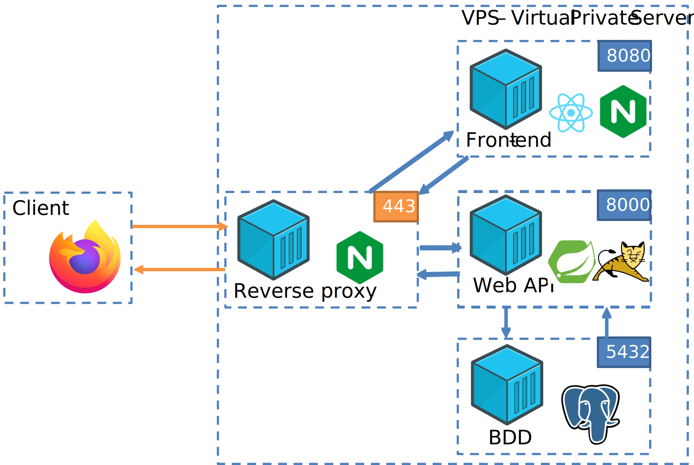

# Stack Docker Postgre + Springboot + React

Vous trouverez dans ce dépôt les fichiers de configurations Docker permettant de mettre en place l'architecture Docker suivante :



Marche à suivre pour compléter les fichiers :
1. modifier les fichiers de configuration des images Docker nommés "Dockerfile" situés dans les sous-dossiers propres au backend et au frontend
2. modifier le fichier "docker-compose.yml" situé à la racine
3. modifier les fichiers de configuration du "reverse proxy" contenus dans le sous-dossier "nginx" 

Un fois les fichiers modifiés vous pouvez tester votre stack pour lancer la stack Docker (à faire à la racine, là où est situé le fichier "docker-compose.yml") :
```
docker compose up
```